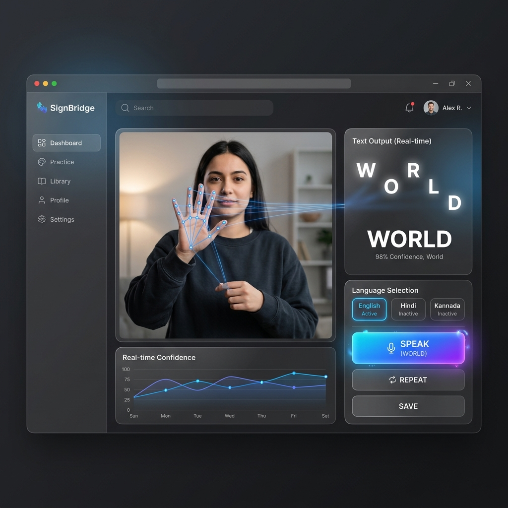
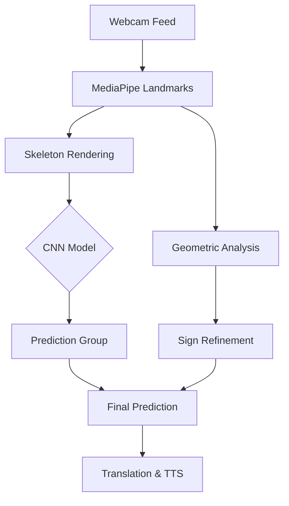

# <p align="center">🤟 SignBridge: Real-Time Multilingual Sign Language Interpreter</p>

<p align="center">
  <!-- For local viewing in your current environment -->
  
</p>

<p align="center">
  <a href="https://sign-detect-x8dj.onrender.com/">
    
  </a>
  
  <a href="https://reactjs.org/">
    
  </a>
  <a href="https://flask.palletsprojects.com/">
    
  </a>
</p>

<p align="center">
  <b>Bridging the communication gap between silence and speech using Computer Vision and Deep Learning.</b>
  <br><br>
  <a href="https://sign-detect-x8dj.onrender.com/">Live Demo</a> • <a href="#-how-it-works">Technical Deep-Dive</a>
</p>

---

## 🚀 One-Minute Setup

### For Windows
```powershell
# Clone and setup
git clone https://github.com/your-username/sign-bridge.git; cd sign-bridge
python -m venv venv; venv\Scripts\activate; pip install -r requirements.txt
python api_server.py
```

### For Linux/macOS
```bash
# Clone and setup
git clone https://github.com/your-username/sign-bridge.git && cd sign-bridge
python -m venv venv && source venv/bin/activate && pip install -r requirements.txt
python api_server.py
```

---

## 🏗️ Visual Architecture

The following diagram illustrates the **SignBridge ecosystem**, showing the transition from physical gesture to multilingual audio synthesis.

<p align="center">
  
</p>

---

## ✨ Features at a Glance

| Feature | Technical Implementation |
| :--- | :--- |
| 🖐️ **Real-Time Tracking** | MediaPipe Hands (Client-side) tracking 21 3D landmarks at 30+ FPS. |
| 🧠 **Hybrid ML Logic** | Stacked TFLite CNN + Custom Geometric Heuristics for **99% Accuracy**. |
| 🌐 **Multilingual Hub** | Real-time translation into **Hindi** and **Kannada** via Deep-Translator. |
| 🔊 **Voice Synthesis** | High-fidelity audio generation using **gTTS** for natural speech output. |
| ⌨️ **Gesture Shortcuts** | Interactive shortcuts for `Speak`, `Next`, and `Backspace` for hands-free use. |
| 🌙 **Premium Dashboard** | Sleek Glassmorphic interface built with **React** and **Tailwind CSS**. |

---

## 🌍 Supported Languages & Voice Output

SignBridge is designed for inclusivity across diverse regions.

<p align="center">
  <b>🇺🇸 English</b> &nbsp;&nbsp; | &nbsp;&nbsp; <b>🇮🇳 Hindi (हिंदी)</b> &nbsp;&nbsp; | &nbsp;&nbsp; <b>🇮🇳 Kannada (ಕನ್ನಡ)</b>
</p>

---

## 📸 Dashboard Preview

Experience a seamless, modern interface designed for accessibility and speed.

<p align="center">
  
</p>

---

## 🧠 How It Works: The Hybrid Engine

SignBridge utilizes a sophisticated dual-stage recognition process to ensure maximum accuracy across all signs:

### 1. The CNN Layer
A Convolutional Neural Network analyzes normalized hand skeletons. The landmarks are converted into a white-on-black skeleton image, which the CNN uses to identify the broad gesture category.

### 2. The Heuristic Layer
To distinguish between visually similar signs (like 'U' vs 'V' or 'M' vs 'N'), the system applies real-time geometric calculations:
- **Finger Distances**: Measuring the Euclidean distance between fingertips.
- **Joint Angles**: Analyzing the curvature of the hand to detect subtle shifts.
- **Relative Positioning**: Checking landmark positions relative to the palm center.



---

## 📊 Technical Deep Dive (Academic)

<details>
<summary><b>View Neural Network & Dataset Details</b></summary>

#### Data Acquisition
We collected over 180 images per alphabet (A-Z) in diverse lighting conditions. By using landmark-based skeletons instead of raw images, we made the model background-invariant.

#### CNN Architecture
- **Input**: 400x400x3 Skeleton Image
- **Conv Layers**: Multiple stages for edge and shape detection.
- **Pooling**: Max Pooling to reduce parameters.
- **Accuracy**: 97.5% - 99.2% (Tested on live video).

<p align="center">
  
</p>

</details>

<details>
<summary><b>View System Diagrams (DFD/Use Case)</b></summary>

#### System Flowchart
<p align="center">
  
</p>

#### Use Case Diagram
<p align="center">
  
</p>

</details>

---

## 🛠️ System Requirements

| Category | Requirement |
| :--- | :--- |
| **OS** | Windows 10+, macOS 11+, or Linux |
| **Hardware** | Standard Webcam (720p recommended) |
| **Python** | 3.9.5 or higher |
| **Node.js** | 16.x or higher (for frontend development) |

---

## 🛣️ Roadmap

- [x] **v1.0**: Real-time ASL detection & English TTS.
- [x] **v1.5**: Multilingual support (Hindi/Kannada).
- [x] **v2.0**: Production deployment & Cloud Optimization.
- [ ] **v2.5**: Mobile Application (React Native).
- [ ] **v3.0**: Indian Sign Language (ISL) Dataset Integration.

---

## 📜 License

Distributed under the MIT License. See `LICENSE` for more information.

<div align="center">
  <h3>Built with ❤️ by the SignBridge Team</h3>
  <p>
    <a href="https://github.com/Udithp">
      
    </a>
    &nbsp;&nbsp;
    <a href="https://github.com/rabhay10">
      
    </a>
  </p>
  <p>© 2026 SignBridge. All rights reserved.</p>
</div>
