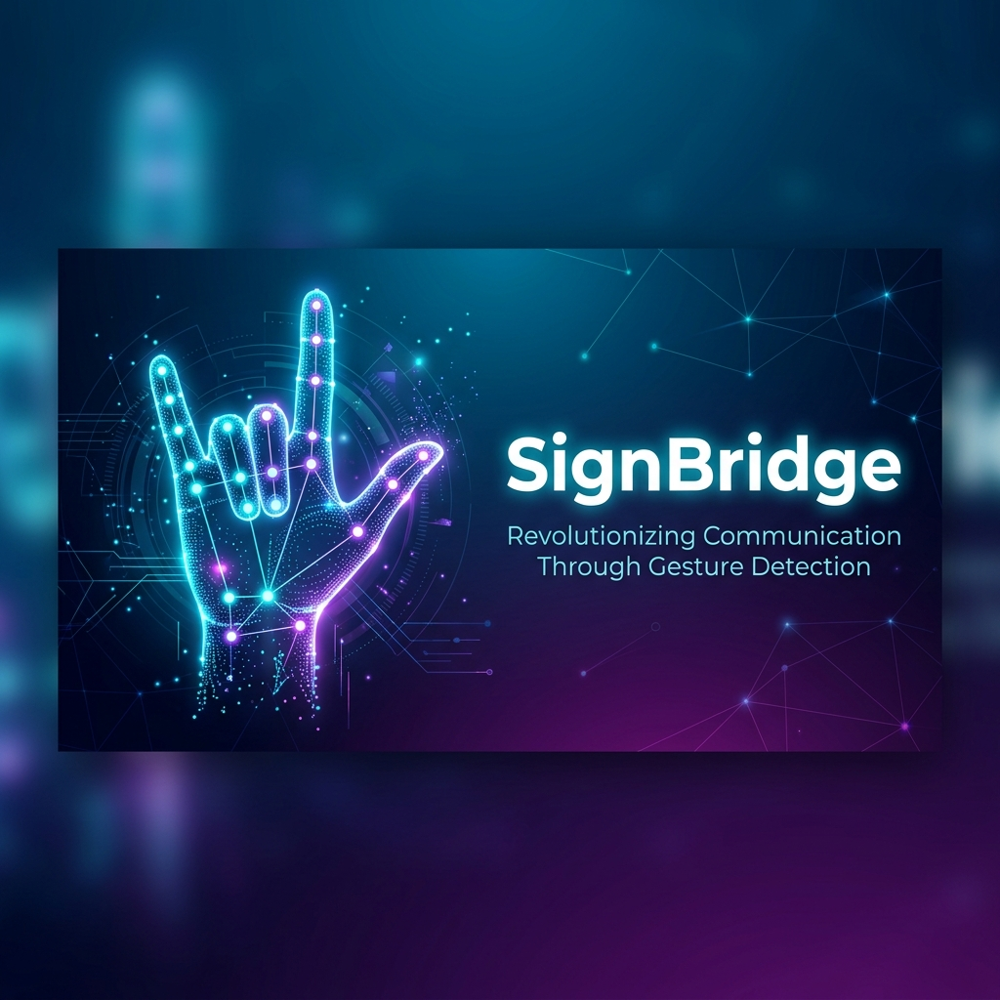
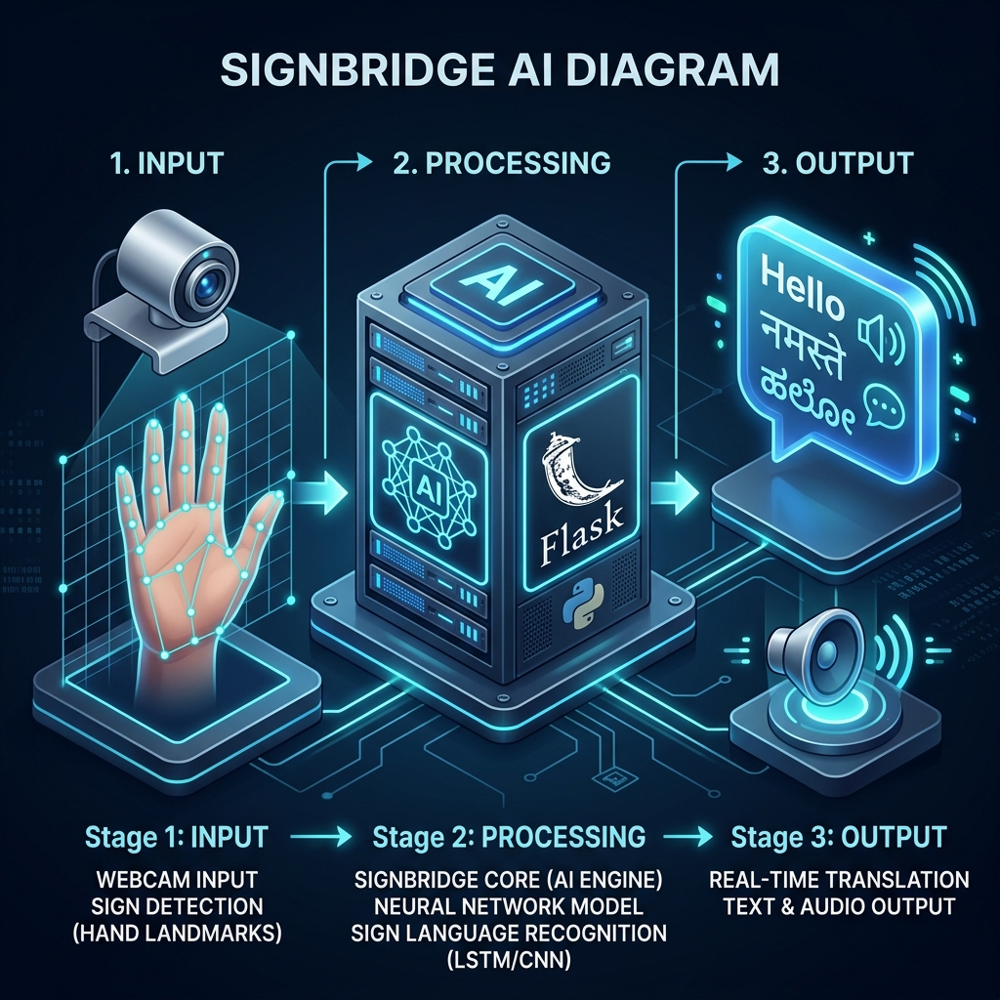
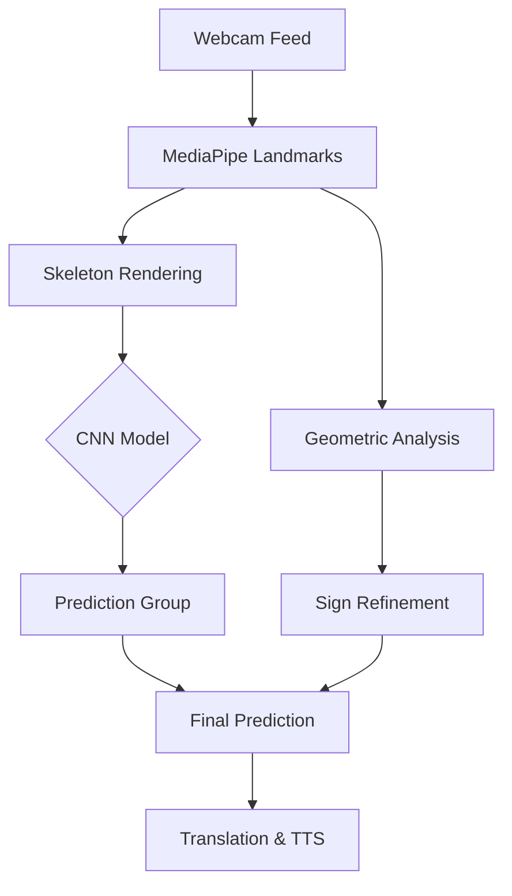

# <p align="center">🤟 SignBridge: Real-Time Multilingual Sign Language Interpreter</p>

<p align="center">
  
</p>

<p align="center">
  <a href="https://sign-detect-x8dj.onrender.com/">
    
  </a>
  
  <a href="https://reactjs.org/">
    
  </a>
  <a href="https://flask.palletsprojects.com/">
    
  </a>
</p>

<p align="center">
  <b>Bridging the communication gap between silence and speech using Computer Vision and Deep Learning.</b>
  <br><br>
  <a href="https://sign-detect-x8dj.onrender.com/">Live Demo</a> • <a href="#-how-it-works">Technical Deep-Dive</a> • <a href="#-interactive-learning">Practice Mode</a>
</p>

---

## ✨ Features at a Glance

| Feature | Technical Implementation |
| :--- | :--- |
| 🖐️ **Real-Time Tracking** | MediaPipe Hands (Client-side) tracking 21 3D landmarks at 30+ FPS. |
| 🧠 **Hybrid ML Logic** | Stacked TFLite CNN + Custom Geometric Heuristics for **99% Accuracy**. |
| 🌐 **Multilingual Hub** | Real-time translation into **Hindi** and **Kannada** via Deep-Translator. |
| 🔊 **Voice Synthesis** | High-fidelity audio generation using **gTTS** for natural speech output. |
| ⌨️ **Functional Gestures** | Custom drawings for `Speak`, `Next`, and `Backspace` to control the system. |
| 🎓 **Learn ASL Module** | Interactive practice camera with real-time feedback and high-quality reference drawings. |
| 🌙 **Premium Dashboard** | Sleek Glassmorphic interface built with **React** and **Vite**. |

---

## 🎓 Interactive Learning & Practice

SignBridge isn't just an interpreter; it's a learning platform. Our **Learn ASL** module includes:

*   **Real-Time Feedback**: A practice camera that validates your signs as you make them.
*   **System Controls**: Master the essential functional gestures:
    *   **NEXT**: A closed fist (Handshape 'S') to confirm words and add spaces.
    *   **BACKSPACE**: A leftward sweep to delete the last character.
    *   **SPEAK**: A thumbs-up gesture to trigger the multilingual text-to-speech.
*   **High-Quality Reference**: Professional line-art drawings for every sign and functional control.

---

## 🏗️ Visual Architecture

The following diagram illustrates the **SignBridge ecosystem**, showing the transition from physical gesture to multilingual audio synthesis.

<p align="center">
  
</p>

---

## 🧠 How It Works: The Hybrid Engine

SignBridge utilizes a sophisticated dual-stage recognition process to ensure maximum accuracy:

### 1. The CNN Layer
A Convolutional Neural Network analyzes normalized hand skeletons. The landmarks are converted into a white-on-black skeleton image, which the CNN uses to identify the broad gesture category.

### 2. The Heuristic Layer
To distinguish between visually similar signs (like 'U' vs 'V' or 'M' vs 'N'), the system applies real-time geometric calculations:
- **Finger Distances**: Measuring the Euclidean distance between fingertips.
- **Joint Angles**: Analyzing the curvature of the hand to detect subtle shifts.
- **Relative Positioning**: Checking landmark positions relative to the palm center.



---

## 🚀 Setup & Installation

### Local Setup (Windows/Linux/macOS)
```bash
# 1. Clone the repository
git clone https://github.com/Udithp/sign-detect.git
cd sign-detect

# 2. Setup Virtual Environment & Install Dependencies
python -m venv venv
# Windows:
venv\Scripts\activate
# Linux/macOS:
source venv/bin/activate

pip install -r requirements.txt

# 3. Run the Application
python api_server.py
```
The application will be available at `http://localhost:5000`.

---

## 💻 Tech Stack

- **ML/Vision**: TensorFlow Lite, MediaPipe, OpenCV
- **Backend**: Flask, Deep-Translator, gTTS
- **Frontend**: React.js, Vite, Framer Motion
- **Deployment**: Render (Gunicorn)

---

## 🛣️ Roadmap

- [x] **v1.0**: Real-time ASL detection & English TTS.
- [x] **v1.5**: Multilingual support (Hindi/Kannada).
- [x] **v2.0**: Interactive Learning Module & Functional Gestures.
- [ ] **v2.5**: Mobile Application (React Native).
- [ ] **v3.0**: Indian Sign Language (ISL) Dataset Integration.

---

## 📜 License

Distributed under the MIT License. See `LICENSE` for more information.

<div align="center">
  <p>Built with ❤️ by the SignBridge Team</p>
  <p>© 2026 SignBridge. All rights reserved.</p>
</div>
